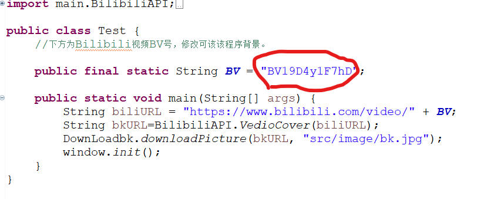

# 27-animal-identify    基于百度API接口实现的动物识别程序   
## *这是第27组的开源项目，旨在实现将用户提交的动物图片进行品种识别并展开百度百科帮助用户了解该动物品种*
## 小组成员：郑丁宇、王湘钧、葛烨、张恩泽、聂子博 组长：郑丁宇
  
### **使用的JRE System Library版本为jdk-15.0.2**
### **TIP : 引入的第三方包放在JarPackage文件夹下**
(程序主要完成者不会建立Maven项目QAQ)
  
## 项目版本更新经过------------------
### >版本1.0：   
   >
   > 初步实现百度识别图片接口  
   > 简单完成了识别功能 
  
________________________________________________________________________
  
### >版本1.1：
   >
   > 1.修改了.classpath文件，解决了原本无法引入第三方包的问题
   > 2.添加了MIT许可证。

________________________________________________________________________
  
### >版本1.2：
   >
   > 1.更新UI界面  添加了背景图片（UI界面有些许bug，后续修复）
   > 2.增加第三方与bilibili相关的接口（仅完成接口，未实现功能）    

________________________________________________________________________
  
### >版本1.3：
   >
   > 1.修复1.2版本UI界面bug
   >> 2.添加趣味功能：Test测试文件中增加了常量"BV"，BV内容可修改，BV内容应为Bilibili视频的Bv号。（功能：获取对应视频的封面图片，作为该程序ui的背景图片）  
   >>示例：  
   >>
   >>----
   >>
   >>----
   >>
   >>----
   >>

________________________________________________________________________
